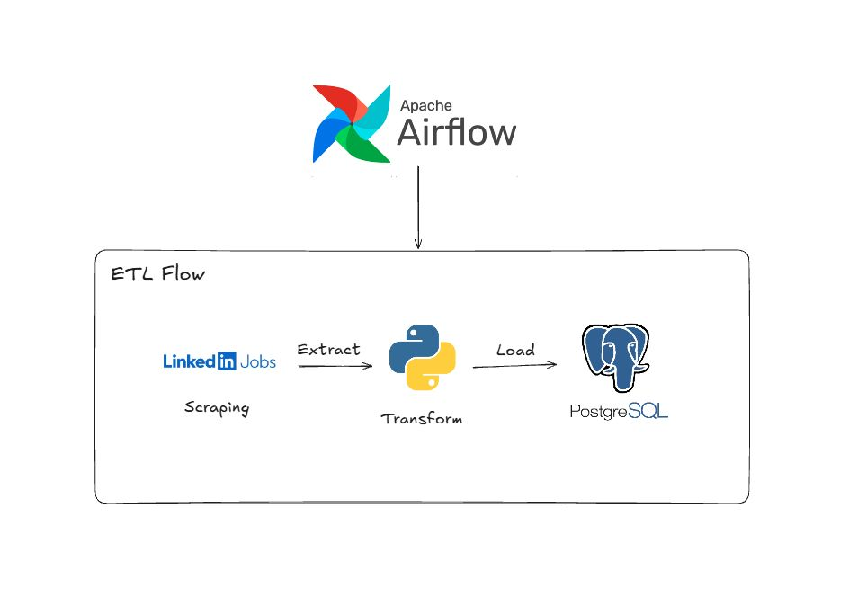

# LinkedIn Job ETL Pipeline with Apache Airflow

A simple end-to-end **ETL (Extract, Transform, Load) pipeline** to scrape job vacancies from LinkedIn, process the data, and load it into a PostgreSQL database using **Apache Airflow** and **Docker**.

This project was built as a hands-on learning project to finally *start using Airflow after installing it for a long time* 😄

---

## 🖼️ ETL Workflow Diagram



---

## 🚀 Project Overview

The pipeline consists of three main stages orchestrated by **Apache Airflow DAG**:

### 1. **Extract**
- Scrapes job vacancy data from LinkedIn
- Supports multi-page scraping (configurable)
- Outputs raw job data into CSV format

### 2. **Transform**
- Cleans and standardizes scraped data
- Extracts and maps required skills using a predefined dictionary
- Removes unnecessary fields
- Produces a transformed CSV file

### 3. **Load**
- Loads the transformed data into a PostgreSQL database
- Uses an auto-increment ID (no reset on re-run)
- Ready for analytics or dashboarding

**Pipeline Flow:**
```
LinkedIn Jobs
     ↓
 [ Extract ]
     ↓
  Raw CSV
     ↓
 [ Transform ]
     ↓
  Clean CSV
     ↓
  [ Load ]
     ↓
 PostgreSQL
```

---

## 🧱 Tech Stack

- **Python** - Core programming language
- **Apache Airflow** - Workflow orchestration
- **Docker & Docker Compose** - Containerization
- **PostgreSQL** - Data storage
- **Pandas** - Data processing
- **BeautifulSoup / Requests** - Web scraping

---

## 📁 Project Structure

```
.
├── dags/
│   ├── dag.py                 # Airflow DAG definition
│   └── etl/
│       ├── main.py            # Local runner (non-Airflow)
│       ├── scraper.py         # Extract logic
│       ├── transform.py       # Transform logic
│       └── load.py            # Load logic
│
├── data/
│   └── skills_dict.txt        # Skill dictionary for transformation
│
├── docker-compose.yaml        # Airflow + Postgres setup
├── .gitignore
└── README.md
```

---

## ⚙️ Setup & Installation

### Prerequisites
- Docker
- Docker Compose

### 1️⃣ Start Airflow with Docker

```bash
docker-compose up -d
```

Wait until all services are healthy.

### 2️⃣ Access Airflow UI

Open your browser and navigate to:
```
http://localhost:8080
```

**Default credentials:**
- Username: `airflow`
- Password: `airflow`

### 3️⃣ Trigger the DAG

1. Open DAG: `linkedin_etl_pipeline`
2. Click **Trigger DAG**
3. Observe task execution: `scrape → transform → load`

---

## 🔧 Configuration

### Change Number of Scraped Pages

You can configure the number of pages scraped by:
- Setting an environment variable, OR
- Directly modifying `scraper.py`

This allows the pipeline to scale without changing the DAG logic.

---

## 🧪 Local Testing (Without Airflow)

You can run the pipeline locally for debugging:

```bash
python dags/etl/main.py
```

This is useful for testing before running in Airflow.

---

## 📌 Notes & Learnings

- Airflow tasks should not return large objects (XCom serialization issues)
- File paths inside Docker must use `/opt/airflow/...`
- Volumes are critical for data persistence
- ETL logic should be reusable both inside and outside Airflow

---

## 🎯 Future Improvements

- [ ] Load data into BigQuery
- [ ] Add data quality checks
- [ ] Implement incremental scraping (avoid duplicates)
- [ ] Add monitoring & alerting
- [ ] Visualize data with BI tools (Tableau, Power BI, etc.)

---

## 👤 Author

**Naufal Faiz**  
Data & Automation Enthusiast

---

## 📄 License

This project is open source and available for educational purposes.
